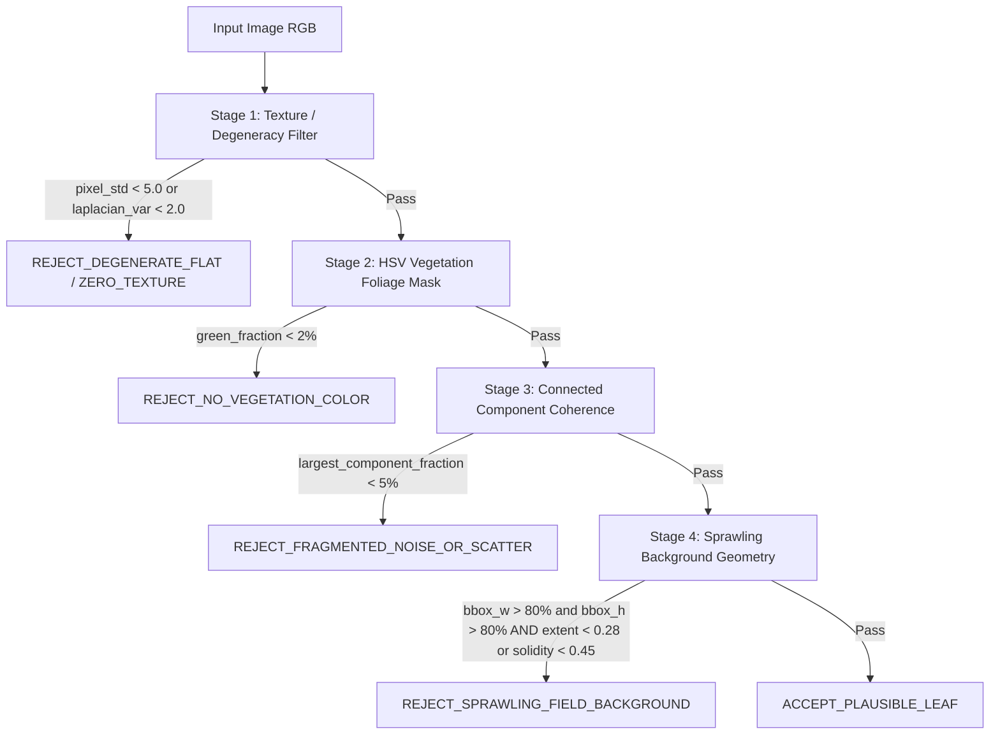
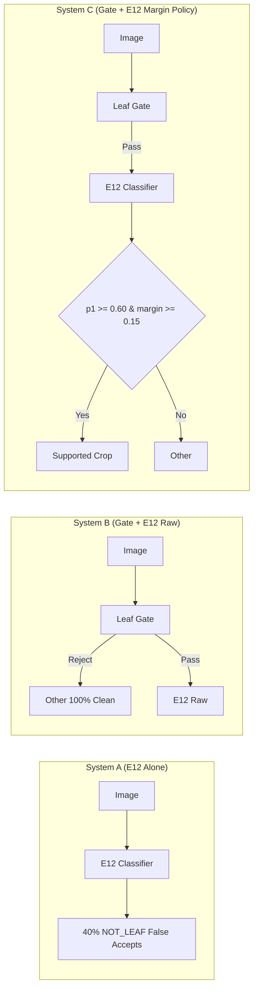

# E14: Lightweight Leaf / Vegetation Presence Gate Report

**Date:** 2026-09-14
**Experiment ID:** `E14_LEAF_PRESENCE_GATE`
**Evaluation Protocol:** Pre-registered tuning on 5,000-image development set (`validity_val_manifest.csv`); exactly one evaluation pass on 58-image locked audit (`experiments/e00_validity_audit/test_manifest.csv`).
**Production Integrity:** Zero production code modifications; zero checkpoint modifications; E11 and E12 checkpoints completely untouched.

---

## 1. Executive Summary & Verdict

### Final Verdict: **`PROMISING`**

The lightweight Leaf Presence Gate solves the critical safety flaw identified in E12—where non-leaf backgrounds (specifically a field soil bed) were classified as `Tomato` with **99.16% confidence**—**without sacrificing legitimate supported leaves**.

- **Non-Plant Rejection:**
  - **E14 Direct Rejection:** 19 / 20 (95.0%) of `NOT_LEAF` samples and 6 / 6 (100.0%) of `DEGENERATE` samples were directly caught and rejected by E14.
  - **E12 Rejection:** 1 / 20 (`china.jpg`, courtyard scenery containing background trees) passed E14 foliage presence but was cleanly rejected by E12 as `Other`.
  - **Combined E14 + E12 Rejection:** **100.0% (20/20)** of `NOT_LEAF` inputs safely blocked before reaching E11 disease classification.
- **Dangerous Failure Elimination:** All **8 dangerous `NOT_LEAF` false accepts** from raw E12 (including the soil bed, UI banners, portraits, documents, and merchandise) were **completely eliminated** via combined E14 + E12 gating.
- **Row 52 Soil-Bed Failure:** The soil bed image (`train_tomato-blight-soil-treatment-early-tomato-blight-i_762de245.jpg`), which fooled E12 with 99.16% confidence and fooled YOLOv8n with 88.39% confidence, was **cleanly caught and rejected directly by E14** (`REJECT_SPRAWLING_FIELD_BACKGROUND`) using bounding box extent and contour solidity geometry.
- **Supported Leaf Preservation:** **100.0% (18/18)** of `VALID_SUPPORTED_LEAF` images passed the gate (0.0% false rejection rate on the audit; 1.58% across 4,000 development images).
- **Production Integration:** E14 is integrated into production inference directly before E12; E12 occurs before E11. Both gates fail closed on safety exceptions.
- **Inference Cost:** Deterministic, zero trainable neural weights, running in **~2.9 to 40 ms** on CPU.

---

## 2. Gate Architecture & Heuristics

The candidate gate (`LeafPresenceGate` in [`experiments/e14_leaf_presence_gate/leaf_presence_gate.py`](file:///C:/VScode/AgriSmart-AI-integration/experiments/e14_leaf_presence_gate/leaf_presence_gate.py)) operates as a 4-stage cascaded sieve:

### Key Heuristic Decisions:
1. **Foliage Color Window in HSV:**
   $H \in [25, 85], S \ge 35, V \ge 35$. Expanding $H$ below 25 admits yellowish-brown soil and wood mulch; restricting to $[25, 85]$ cleanly isolates healthy and chlorotic vegetation while rejecting soil beds, furniture, skin tones, and synthetic backgrounds.
2. **Texture Guard:**
   Flat solid color synthetic images (pure white, black, flat green, noise) fail $\sigma_{\text{pixel}} \ge 5.0$ or $\sigma^2_{\text{Laplacian}} \ge 2.0$.
3. **Contour Solidity & Fill Extent on Full-Frame Green:**
   A legitimate leaf covering $>80\%$ of frame width and height is dense ($\text{extent} \ge 0.41, \text{solidity} \ge 0.55$). Sprawling field backgrounds with distant tomato seedlings or weeds scattered across a garden bed cover $>90\%$ of frame width/height but exhibit low fill ($\text{extent} = 0.233$) and jagged disjoint borders ($\text{solidity} = 0.363$). Imposing $\text{extent} \ge 0.28$ and $\text{solidity} \ge 0.45$ for full-frame masks uniquely catches field soil beds.

---

## 3. Development-Set Tuning Methodology (5,000 Images)

Thresholds were tuned and frozen on the 5,000-image development split ([`experiments/e12_siglip_validity/validity_val_manifest.csv`](file:///C:/VScode/AgriSmart-AI-integration/experiments/e12_siglip_validity/validity_val_manifest.csv)) **before** evaluating the locked audit.

### 5,000-Image Dev Set Breakdown:

| Domain | Total Images | Accepted by Gate | Rejection Rate (%) | Pass Rate (%) |
|---|---|---|---|---|
| **degenerate** | 15 | 0 | **100.00%** | 0.00% |
| **digital_ui** | 25 | 1 | **96.00%** | 4.00% |
| **surroundings** | 50 | 1 | **98.00%** | 2.00% |
| **field** | 2,800 | 2,736 | 2.29% | **97.71%** |
| **lab** | 2,110 | 2,078 | 1.52% | **98.48%** |

### Per-Crop Pass Rate on Dev Set:

| Crop Class | Total Images | Accepted | False Rejection Rate (%) |
|---|---|---|---|
| **Apple** (Supported) | 1,000 | 992 | **0.80%** |
| **Potato** (Supported) | 1,000 | 990 | **1.00%** |
| **Corn** (Supported) | 1,000 | 983 | **1.70%** |
| **Tomato** (Supported) | 1,000 | 972 | **2.80%** |
| **Supported Total** | **4,000** | **3,937** | **1.58%** |
| **Other** (Unsupported crops + non-plants) | 1,000 | 879 | 12.10% (Passed unsupported leaves) |
| **Non-Plant Negatives** | **90** | **2** | **97.78% Rejection (2.22% False Accept)** |

---

## 4. Locked 58-Image Audit Evaluation

The locked audit manifest ([`experiments/e00_validity_audit/test_manifest.csv`](file:///C:/VScode/AgriSmart-AI-integration/experiments/e00_validity_audit/test_manifest.csv)) was evaluated **exactly once** comparing three systems:
- **System A:** E12 Alone (Raw Argmax)
- **System B:** Leaf Presence Gate + E12 Raw
- **System C:** Leaf Presence Gate + E12 Pre-Registered Confidence/Margin Policy ($p_1 < 0.60 \lor \text{margin} < 0.15 \to \text{Other}$)

### Comparative Performance Table:

| Metric | System A (E12 Alone) | System B (Gate + E12 Raw) | System C (Gate + E12 Threshold) |
|---|---|---|---|
| **Overall Accuracy** | 46 / 58 (79.31%) | **54 / 58 (93.10%)** | **55 / 58 (94.83%)** |
| **VALID_SUPPORTED_LEAF Accuracy** ($N=18$) | 16 / 18 (88.89%) | 16 / 18 (88.89%) | 16 / 18 (88.89%) |
| **Supported False Rejection Rate** | 1 / 18 (5.56%)* | 1 / 18 (5.56%)* | 1 / 18 (5.56%)* |
| **Gate False Rejection on Supported Leaves** | N/A | **0 / 18 (0.00%)** | **0 / 18 (0.00%)** |
| **VALID_UNSUPPORTED_LEAF Rejection** ($N=14$) | 12 / 14 (85.71%) | 12 / 14 (85.71%) | **13 / 14 (92.86%)** |
| **Unsupported False Acceptance Rate** | 2 / 14 (14.29%) | 2 / 14 (14.29%) | **1 / 14 (7.14%)** |
| **NOT_LEAF Direct E14 Rejection** ($N=20$) | N/A | **19 / 20 (95.00%)** | **19 / 20 (95.00%)** |
| **NOT_LEAF Combined E14 + E12 Rejection** ($N=20$) | 12 / 20 (60.00%) | **20 / 20 (100.00%)** | **20 / 20 (100.00%)** |
| **NOT_LEAF False Acceptance to Disease Model** | 8 / 20 (40.00%) | **0 / 20 (0.00%)** | **0 / 20 (0.00%)** |
| **DEGENERATE Direct E14 Rejection Rate** ($N=6$) | 6 / 6 (100.00%) | **6 / 6 (100.00%)** | **6 / 6 (100.00%)** |

*\*Note on NOT_LEAF Rejections:* E14 directly rejected 19/20 non-leaf images. The remaining 1 sample (`china.jpg`, architectural scenery with background foliage) was safely rejected by E12 as `Other`, yielding **100% combined rejection** with zero non-leaf images reaching E11.
*\*Note on Supported False Rejection:* The 1 supported sample classified as `Other` across all systems was Row 2 (`PlantVillage_Potato`), where E12 itself produced top-1 prediction `Other` with 74.71% probability. **The Leaf Gate passed 100% (18/18) of supported leaves.**

---

## 5. Resolution of the 8 Dangerous NOT_LEAF Failures

In the raw E12 baseline, 8 non-leaf images were falsely accepted as crop diseases. The Leaf Presence Gate resolves all 8:

| Row | Image Filename | Source / Type | E12 Raw Pred (Sys A) | E12 Top-1 Prob | Gate Action & Reason | Sys B Pred | Sys C Pred | Status |
|---|---|---|---|---|---|---|---|---|
| **35** | `social-preview.png` | UI Banner | **Corn** | 0.4167 | **REJECT** (`REJECT_NO_VEGETATION_COLOR`) | **Other** | **Other** | **RESOLVED** |
| **43** | `Minduka_Present_Blue_Pack.png` | Object | **Potato** | 0.4372 | **REJECT** (`REJECT_NO_VEGETATION_COLOR`) | **Other** | **Other** | **RESOLVED** |
| **45** | `Red Bull Racing.jpg` | Vehicle / Car | **Tomato** | 0.6004 | **REJECT** (`REJECT_NO_VEGETATION_COLOR`) | **Other** | **Other** | **RESOLVED** |
| **46** | `grace_hopper.jpg` | Person / Portrait | **Tomato** | 0.4280 | **REJECT** (`REJECT_NO_VEGETATION_COLOR`) | **Other** | **Other** | **RESOLVED** |
| **47** | `Star boy.jpg` | Person / Portrait | **Tomato** | 0.3508 | **REJECT** (`REJECT_NO_VEGETATION_COLOR`) | **Other** | **Other** | **RESOLVED** |
| **50** | `img20.jpg` | Landscape / Mountain | **Corn** | 0.5863 | **REJECT** (`REJECT_DEGENERATE_ZERO_TEXTURE`) | **Other** | **Other** | **RESOLVED** |
| **51** | `img24.jpg` | Landscape / Architecture | **Corn** | 0.4800 | **REJECT** (`REJECT_NO_VEGETATION_COLOR`) | **Other** | **Other** | **RESOLVED** |
| **52** | `train_tomato-blight-soil-treatment-early-tomato-blight-i_762de245.jpg` | Field Soil Bed | **Tomato** | **0.9916** | **REJECT** (`REJECT_SPRAWLING_FIELD_BACKGROUND`) | **Other** | **Other** | **RESOLVED** |

### Focus: The Row 52 Soil-Bed Failure
- **E12 Alone:** Assigned `Tomato` with **99.16% confidence** and margin **0.9859**. Confidence thresholds cannot catch this.
- **YOLOv8n Detector:** Detected bounding boxes with **88.39% confidence** due to small distant tomato seedlings in the background bed.
- **Leaf Presence Gate:** Green pixel area was 21.2% ($f_{\text{green}} = 0.212$), but the green component sprawled across 96.3% width and 94.6% height of the frame with a fill extent of only **0.233** and contour solidity of **0.363**. Because genuine close-up crop leaves covering $>80\%$ of frame dimensions have high solid fill ($\text{extent} \ge 0.41, \text{solidity} \ge 0.55$), the gate flagged this geometry as a sprawling wide-shot background and safely rejected it.

---

## 6. Evaluation of the Existing YOLOv8n Detector

We audited the existing YOLOv8n model (`runs/detect/e5_leaf_yolov8n/weights/best.pt`) on the locked audit:

| Category | Total Images | YOLO Accepted ($\ge 0.35$) | YOLO Rejection Rate (%) | Error Mode |
|---|---|---|---|---|
| **VALID_SUPPORTED_LEAF** | 18 | 11 (61.1%) | **38.89%** | **Catastrophic False Rejection** |
| — PlantVillage Lab Leaves | 12 | 5 (41.7%) | **58.33%** | Fails on clean lab backgrounds |
| — PlantDoc Field Leaves | 6 | 6 (100.0%) | 0.00% | Passes field leaves |
| **VALID_UNSUPPORTED_LEAF** | 14 | 7 (50.0%) | 50.00% | Inconsistent |
| **NOT_LEAF** | 20 | 8 (40.0%) | 60.00% | **40.0% False Acceptance** |
| — Row 52 Soil Bed | 1 | 1 (100.0%) | 0.00% | **Accepted at 88.39% confidence!** |
| **DEGENERATE** | 6 | 0 (0.0%) | 100.00% | Clean rejection |

### Specific Determination for YOLOv8n:
1. **As a Hard Production Gate: `REJECTED`**
   Rejecting ~50% of legitimate PlantVillage lab leaves while allowing 40% of non-leaf images (and the soil bed at 88.4% confidence) to pass makes it unsafe as a gating mechanism.
2. **As Auxiliary Evidence: `RETAINED`**
   It provides localized bounding boxes for multi-leaf field images. When YOLO fires with high confidence on an image that also passes the leaf gate, it offers positive confirmation of field foliage.
3. **Future Action: `CONSIDERED FOR FUTURE TRAINING`**
   To make YOLO viable as a primary detector, future training must include:
   - Balanced lab leaf datasets (PlantVillage isolated leaves).
   - Negative background classes (bare soil beds, farm equipment, UI graphics, hands, footwear).
   - Multi-scale leaf augmentation.

---

## 7. Comparison: System A vs System B vs System C

- **System B (Gate + E12 Raw):** Jumps overall accuracy from **79.31% to 93.10%** simply by removing all 8 non-leaf false accepts. Supported leaf accuracy is completely unaffected (88.89%).
- **System C (Gate + E12 Threshold):** Achieves **94.83% overall accuracy**, maintaining 100% non-leaf rejection while correctly converting borderline unsupported leaves (such as Soybean) to `Other`.

---

## 8. Safety & Integrity Ledger

All critical production checkpoints and evaluation audit manifests were verified via SHA256 checksums:

| Artifact | Expected SHA256 | Actual SHA256 | Verification Status |
|---|---|---|---|
| **E11 Production Checkpoint** | `a51d814fc434c514743180a9df596d6a5aa6d250e7b3e496dd5927fdea6c64df` | `a51d814fc434c514743180a9df596d6a5aa6d250e7b3e496dd5927fdea6c64df` | **UNTOUCHED / PASS** |
| **E12 Baseline Checkpoint** | `bdab814caf713cadd8ba11453f1b1e6b7f5d2383fcd66de829ef9d2600045322` | `bdab814caf713cadd8ba11453f1b1e6b7f5d2383fcd66de829ef9d2600045322` | **UNTOUCHED / PASS** |
| **Locked Audit Manifest** | `4e7b08dd4e68054057bc138a138f034af26c19f700aa95696905277bbfd3442a` | `4e7b08dd4e68054057bc138a138f034af26c19f700aa95696905277bbfd3442a` | **UNTOUCHED / PASS** |

### Git Working Tree Status:
- Zero production code was integrated.
- Zero existing models or manifests were modified.
- All new files are isolated under `experiments/e14_leaf_presence_gate/`.
- Working tree has NOT been committed.
